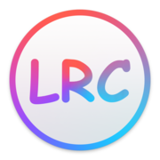

<p align="center">
    <a href="https://d.cdgzofc.cn">
        
    </a>
</p>

## 概要

**歌词滚动姬提效版** 是在原版 [LRC-Maker](https://github.com/magic-akari/lrc-maker) 基础上的深度进化版本。保留了原版轻量、跨平台、纯前端运行的特性，并针对专业用户和高频使用者增加了一系列增强功能。

### 1. 自定义键位系统

- **全键位自定义**: 支持在[键位设置](https://d.cdgzofc.cn/#/keybindings/)页录制并修改所有操作的快捷键。

### 2. 效率模式 (交互式歌词)

- **点击跳转**: 在[首选项](https://d.cdgzofc.cn/#/preferences/)页开启**交互式歌词**后，点击任意歌词行，音频将自动跳转到该行对应的时间戳。
- **快速复听**: 极大方便了对特定行时间戳的反复确认与微调。

### 3. 外部参数快捷导入与音乐平台支持

- **URL 参数导入**: 支持通过 `?url=音频链接` 快捷加载音频（支持网易云音乐歌曲ID以及音频URL自动解析）。
  - 示例：[https://d.cdgzofc.cn/?url=2082125990](https://d.cdgzofc.cn/?url=2082125990)
- **Text 参数导入**: 支持通过 `?text=文本链接` 快捷导入外部文本。

### 4. 增强的偏好设置

- **前进/后退步进**: [首选项](https://d.cdgzofc.cn/#/preferences/)新增自定义前进/后退时间（默认 5000ms）。
- **微调偏移量**: 新增微调偏移量设置（默认 500ms），支持用户自定义单行微调的时间长度。
- **后台播放**: 新增开关，允许音频在浏览器标签页处于后台时继续播放，方便对照其他窗口。

### 5. UI 与交互改进

- **通知关闭按钮**: 所有的通知弹窗（Toast）现在都带有显式的关闭按钮。
- **响应式设计增强**: 针对不同尺寸的屏幕进行了更深度的布局优化，确保在移动端和宽屏下都有良好的体验。

### 6. LRC 输出优化

- **精简输出**: 删除了默认生成的 `[tool]` 和 `[length]` 标签。

### 7. 实用工具 lrc-utils 相关

- **时间偏移默认值**: 支持用户自定义默认的时间整体偏移值，支持一键应用。
- **兼容性修复**: 修复 iOS Safari 使用歌词覆写排版错乱的问题。

## 本地开发

### 环境要求

- [Node.js](https://nodejs.org/) >= 22
- [pnpm](https://pnpm.io/) >= 10

### 安装与运行

```bash
# 克隆仓库
git clone https://github.com/CDGZ-ofc/lrc-maker-cdgz.git
cd lrc-maker-cdgz

# 安装依赖
pnpm install

# 启动开发服务器
pnpm start
```

### 代码检查

```bash
# 格式化检查
pnpm run check:fmt

# 自动修复格式问题
pnpm run fix:fmt

# 静态检查
pnpm run check:lint
```

## 构建与部署

### 构建生产版本

本项目包含子工具 `lrc-utils`，构建主项目前需先构建子工具并复制产物：

```bash
# 1. 构建子工具
cd lrc-utils
pnpm install
pnpm run build

# 2. 复制子工具产物到主项目
cp -r build/* ../public/lrc-utils/

# 3. 回到根目录构建主项目
cd ..
pnpm run build
```

构建产物位于 `build/` 目录，可直接部署至任意静态托管服务。

### 部署到静态托管平台

`build/` 目录为纯静态文件，可部署至以下平台：

- **Vercel**：导入仓库后，将构建命令设为 `pnpm run build`，输出目录设为 `build`
- **GitHub Pages**：通过 GitHub Actions 自动部署
- **Netlify**：导入仓库后，构建命令设为 `pnpm run build`，发布目录设为 `build`
- **其他静态托管**：将 `build/` 目录内容上传至任意静态文件服务器即可

## 许可

本项目基于以下两个 MIT 协议开源项目修改与融合：

- [LRC-Maker](https://github.com/magic-akari/lrc-maker) — 原版的LRC-Maker
- [lrc-utils](https://github.com/magic-akari/lrc-utils) — 歌词工具

均以 [MIT License](https://opensource.org/licenses/MIT) 授权，本项目继承相同协议继续开源。
